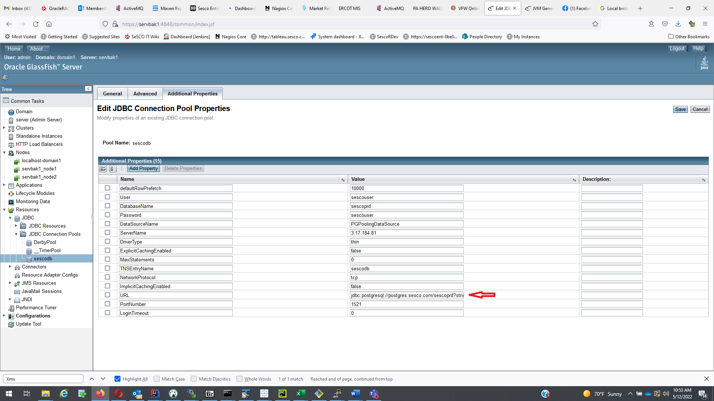
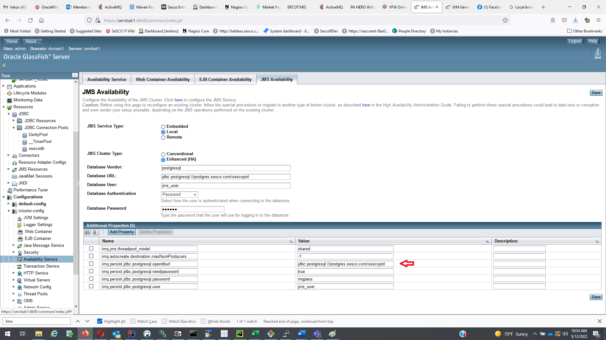

# Disaster Recovery Payara Server

The Disaster Recovery Payara Server is servbak1.  Login as trout user.
    cd /data2/glassfish3/glassfish/bin
    run ./asadmin start-domain domain1

## Configure JDBC connections
By default, the JDBC connection of the Payara server on servbak1 is configured to use __postgres.sesco.com__ as the JDBC commotion host.  If a different host will be used, 2 locations need to be updated.

Open a browser window and open https://servbak1:4848/login.jsf (User: admin, password: tr0ut1).

1. Resources -> JDBC -> JDBC Connection Pool -> sescodb -> Additional Properties tab -> URL and serverName. 



URL format is :
jdbc:postgresql://{DB Server machine DNS name or IP address}{:port if other than 5432}/{schema name}

Ex: 
    
    jdbc:postgresql://postgres.sesco.com/sescoprd
    jdbc:postgresql://postgres.sesco.com:5432/sescoprd
 
2. Configurations -> /sescoprd_config -. Availability Service -> JMS Availability
 
 


## Start the Payara Server
1. Login to servbak1 as trout.
2. ```gf start-cluster icluster```

## Configure clients
Change the jndi.properties file under /sesco/config on job server and trader machines to point to the backup server:<br> com.sun.appserv.iiop.endpoints=servbak1:23700,servbak1:23701

The line should already be in the file, need to comment out the current setting line and comment in the servbak1 line.
Restart jobs and user Sesco applications.

