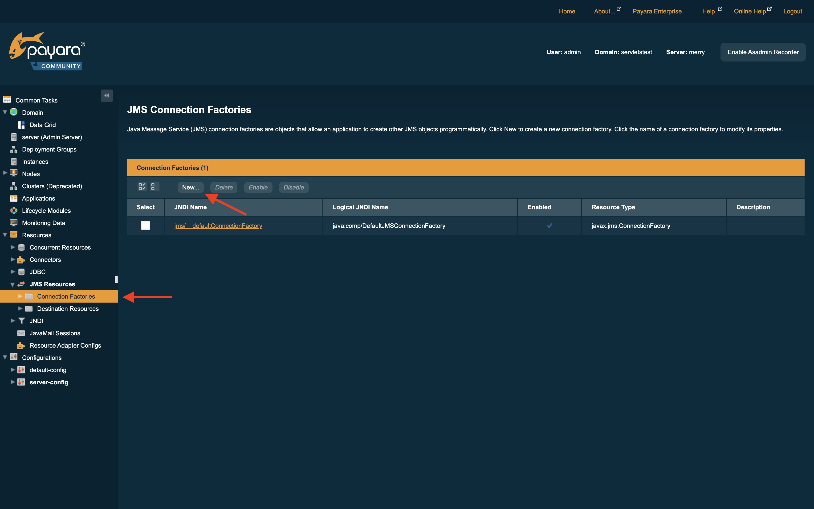
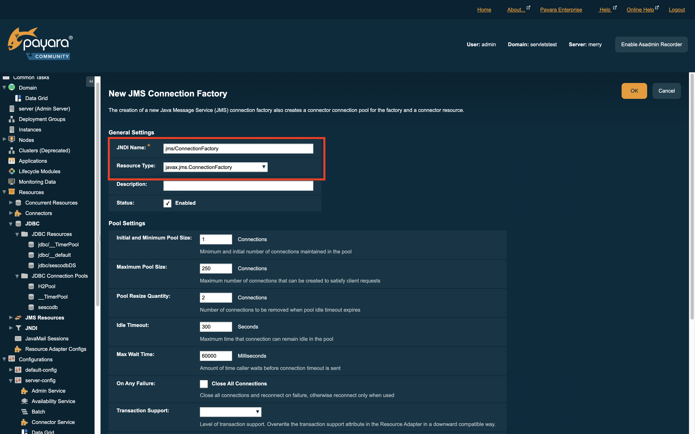
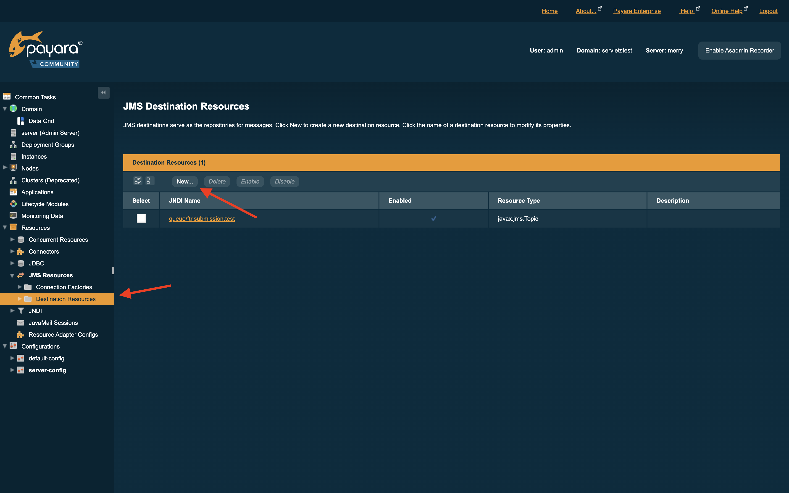
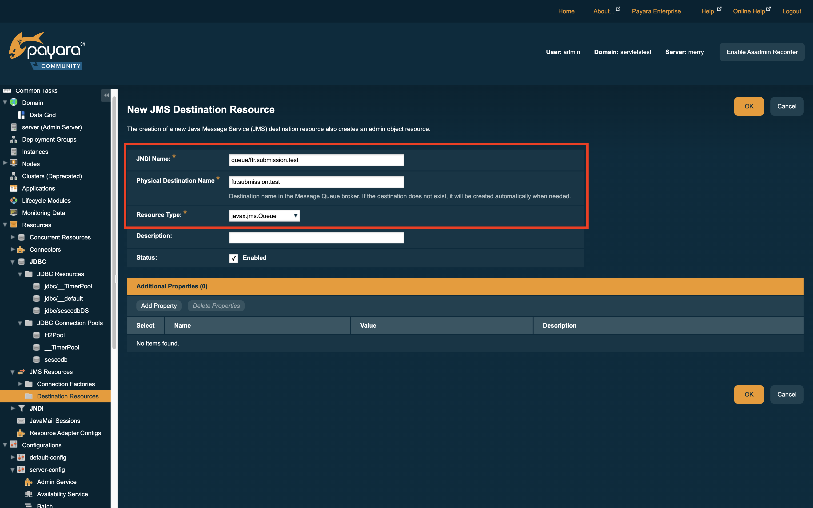

# PAYARA SERVER Instances on merry

The following payara server domains are created on merry [(links)](#application-links)
- DayzerReport
- FTRAnalysis
- FTRTrading
- Keystone
- NIServer
- smsService
- ServletsTest

## Creating a domain for each of the above
### DayzerReports
1. Create the domain using the `--portbase` option 
   ```
   ./asadmin create-domain --portbase=10081 dayzerreports
   ```
   - *see the [Glassfish documentation](https://docs.oracle.com/cd/E26576_01/doc.312/e24938/create-domain.htm#GSRFM00023) (--portbase section)* for a list of ports assigned statically when using the `--portbase` option
   
2. Start the domain
   ```
   ./asadmin start-domain dayzerreports
   ```

3. Change the admin password
   ```
   ./asadmin --port 10129 change-admin-password
   ```
     - username: `admin`
     - password: (check credentials.md for the password)
   - The first prompt is to enter the **current** password, which is empty
     ```
     Enter the admin password>   <---- This prompt 
     Enter the new admin password>
     Enter the new admin password again>
     ```
     
4. Enable secure admin so that we can log in to the UI for the domain
   ```
   ./asadmin --port 10129 enable-secure-admin
   ```

5. Restart the domain
   ```
   ./asadmin stop-domain dayzerreports
   ./asadmin start-domain dayzerreports
   ```
   OR
   ```
   ./asadmin restart-domain dayzerreports
   ```

6. Configure JVM options
   - these can be copied from an existing domain: `/.../payara5/glassfish/domains/[domainName]/config/domain.xml`  
   - The JVM settings are in 
     ```
     <domain>
         <configs>
             <config name="server-config">
                 <java-config> ... </java-config>
             <config name="default-config">
                 <java-config> ... </java-config>
       ```
     - Before copying, be sure to note the current debug port in the `<java-config>` element of your new domain's *server-config*; after copying the JVM settings, ensure the debug port number is correct.
     - Change the heap size options accordingly such as
       ```
       <java-config>
           <jvm-options>-Xmx1024m</jvm-options>
       ```

7. Copy the needed jars to the new domain - see `/.../payara5/glassfish/domains/[domainName]/lib/` of existing domains.

8. Create a JDBC Connection pool
   - Manually
      - PoolName: `sescodb` 
      - Additional Properties
        - URL: `jdbc:postgresql://postgres.sesco.com/sescoprd?stringtype=unspecified`
        - password: `sescouser`
        - databaseName: `sescoprd`
        - defaultRowPrefetch: `10000`
        - serverName: `postgres.sesco.com` (or `postgres-test.sesco.com`) 
        - datasourceName: `sescodb`
        - user: `sescouser`
        - networkProtocol: `tcp`
        - port: `5432`
     
     OR
   - Copy settings from `<jdbc-connection-pool>` *domain.xml*
     ```
     <domain>
         <resources>
             <jdbc-connection-pool ... name="sescodb" ...>
                 ...
             </jdbc-connection-pool>
     ```

9. Add JDBC Resource
   - Copy `<jdbc-resource>` to *domain.xml*
     ```
     <domain>
         <resources>
             <jdbc-resource pool-name="sescodb" jndi-name="jdbc/sescodbDS"></jdbc-resource>
             ...
     ```
   - Copy JNDI reference
     ```
         <domain>
             <servers>
                 <server config-ref="server-config" name="server">
                     <resource-ref ref="jdbc/sescodbDS"></resource-ref>
                     ...
     ```

10. ***SAVE/UPLOAD domain.xml BEFORE EDITING ANY SETTINGS VIA THE ADMIN CONSOLE WEB UI***

11. Create a JMS Connection Factory
    
    

12. Add the topics for the Glassfish instance
    
    

13. Deploy the respective war/ear
    - DayzerReports.war
        - `cd /home/trout/bin`
        - `run /getLatest DayzerReports.war`
        - goto /home/trout/jars and ensure the newest war is renamed without the date in the name 
        - Now deploy the application from the UI. 
        - The same process has to be repeated for all the above services.
    - servletstest
        - locally build the war - run Ant builds for 
          - base
          - coolapp
          - j2ee/servlets
        - deploy war: [your local source dir]/build/j2ee/servlets/dist/Servlets.war

    
## Application Links
For admin on all instances:
- User: `admin`
- PW: check credentials.md for the password


| instance (app port)                                                                | admin port                                    | [portbase](#portbase) | notes                                  |
|------------------------------------------------------------------------------------|-----------------------------------------------|-----------------------|----------------------------------------|
| [**Dayzer Reports** (10160)](http://merry.sesco.com:10161/DayzerReports)           | [10129](https://merry:10129/common/index.jsf) | 9181                  |                                        |
| [**FTRAnalysis** (9261)](http://merry:9261/FTRAnalysis/FTRAnalysisApp.html)        | [9229](https://merry:9229/common/index.jsf)   | 10081                 |                                        |
| [**FTRTrading** (4940)](http://merry.sesco.com:4940/FTRTrading/FTRTradingApp.html) | [4908](https://merry:4908/common/index.jsf)   | 4860                  |                                        |
| [**NIServer** (11161)](http://merry.sesco.com:11161/NIServer)                      | [11129](https://merry:11129/common/index.jsf) | 11081                 |                                        |
| [**Keystone** (5680)](http://merry.sesco.com:5680/Keystone/KeystoneMain.html)      | [5648](https://merry:5648/common/index.jsf)   | 5600                  |                                        |
| [**SMSWeb** (8940)](http://merry.sesco.com:8940/smsService/index.jsp)              | [8908](https://merry:8908/common/index.jsf)   | 8860                  |                                        |
| [**servletstest** (12080)](http://merry.sesco.com:12080/Servlets/)                 | [12048](https://merry:12048/common/index.jsf) | 12000                 | See ServletsTest [Note](#servletstest) |

### Notes
#### ServletsTest
Currently only configured for the purposes of testing the FTR Submissions API.  JMS only configured for `queue/ftr.submission.test` to avoid exceptions.
#### portbase
portbase is not an operable port; it is the port that was used in the command `./asadmin create-domain --portbase=[portbase] [domain name]` - see the [Glassfish documentation](https://docs.oracle.com/cd/E26576_01/doc.312/e24938/create-domain.htm#GSRFM00023) (--portbase section)
#### NAGIOS
The scripts statusViaHttp.pl and statusViaHttp2.pl that point to SMSWeb are on Merry in the /usr/local/nagios/libexec directory
