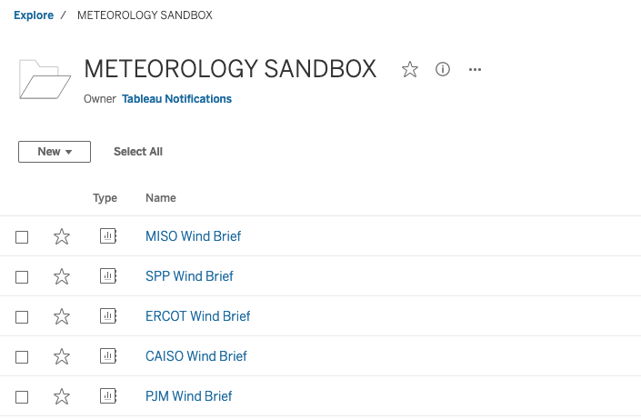
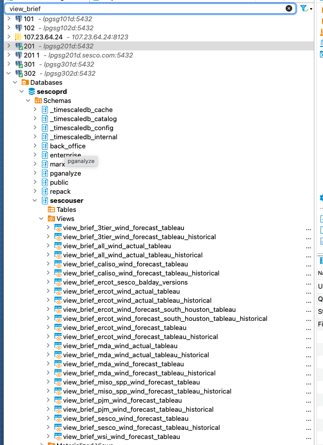

# Wind Briefs

## Location
All ISO briefs are currently located at (https://us-east-1.online.tableau.com/#/site/sescoenterprises/projects/217840).

## Data Source
All briefs use the [Next Day Wind](https://us-east-1.online.tableau.com/#/site/sescoenterprises/datasources/44507905/askData) data source. It is refreshed every 5 minutes in the morning hours, and every 15 minutes in the afternoon hours.

The data source is a union of database views. All views are in the sescouser schema and begin with `view_brief_`. 

## Common problems

### Stale Data
Users may report that tableau is not updating. The first thing to check is if our tableau site is refreshing the data source. Check the [Jobs](https://us-east-1.online.tableau.com/#/site/sescoenterprises/jobs) and see if `Next Day Wind` has run recently. If it has not, you will see either a backlog of jobs or error messages indicating a problem. We can't do anything about a backlog of jobs. The tableau cloud site will have to catch up on its own. 

If jobs are completing the we are probably missing vendor data in the database. The view definitions will show the tables the data is pulled from if you don't know it. This is helpful information to give to on call when reporting that we are missing data.